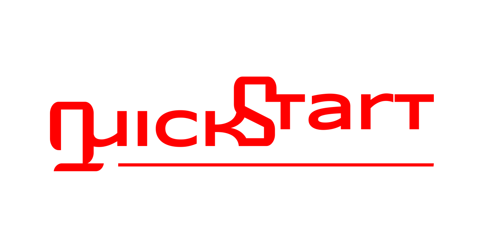

# sc-qs-dc-lemp-mvc-webpack

ScorpioCoing QuickStart Docker Apline Nginx Php MySql (LEMP) stack with MVC
Model-View-Controller Application Setup.  
With Webpack 5.0 as frontend handler.

## Basic Usage

Using Terminal and VSCode

1. Open Termianl and create a directory for your project `mkdir yourproject`
2. Change directory into newly made project directory  
   `cd yourproject `
3. Clone the repo into your project directory
   `git clone git@github.com:ScorpioCoding/sc-qs-dc-lemp-mvc-webpack.git .`
4. Remove the remote repo address `git remove origin`
5. Check if indeed removed `git remote -v`
6. Add your remote from your repo
   `git remote add origin git@github.com:YOURPROFILENAME/projectname.git`
7. Push to branch main on your new repo `git push -u origin main`

ALternative ::

1. Open Termianl and create a directory for your project `mkdir yourproject`
2. Change directory into newly made project directory  
   `cd yourproject `
3. Clone the repo into your project directory
   `git clone git@github.com:ScorpioCoding/sc-qs-dc-lemp-mvc-webpack.git .`
4. Delete the `.git` directory and init git a new.

VSCode ::

1. Termianl run the following command `code . ` to pen VSCode in your project
   directory.

Docker ::

1. open a new terminal and go into \_dockerfiles
2. either run the original docker commands or the commands in the MakeFile

- run docker command to start
  ```
  docker compose up -d
  ```
- run docker command to stop
  ```
  docker compose down
  ```

MakeFile ::  
The MakeFile is a collection of frequently used Docker commands in a shorter
version.  
To use the Makefile enter the following command `make` in the terminal within
the directory where the makefile exists.

Browser ::

- The frontend http://localhost:6080

- phpMyadmin http://localhost:6081

## Advanced Usage

### Frontend development

In the `dev` directory is where all frontend source code should go. For every
view, scss, js file you create you need to modify webpack `webpack.common.js`
add your entry points You can add multiple
[entry points](https://webpack.js.org/concepts/entry-points/)

The advantage of using this package is the ability to easley add Bootstrap,
jQuery, Tailwindcss etc to your frontend development and have webpack bundle it.

Views have the extension `.phtml` for this is the original php template
extension.

### Backend Development

If one creates a new submodule one must add this to `App/config/modules.php`
file

New routes are added to the `App/Routes/`

The rest is basic MVC
